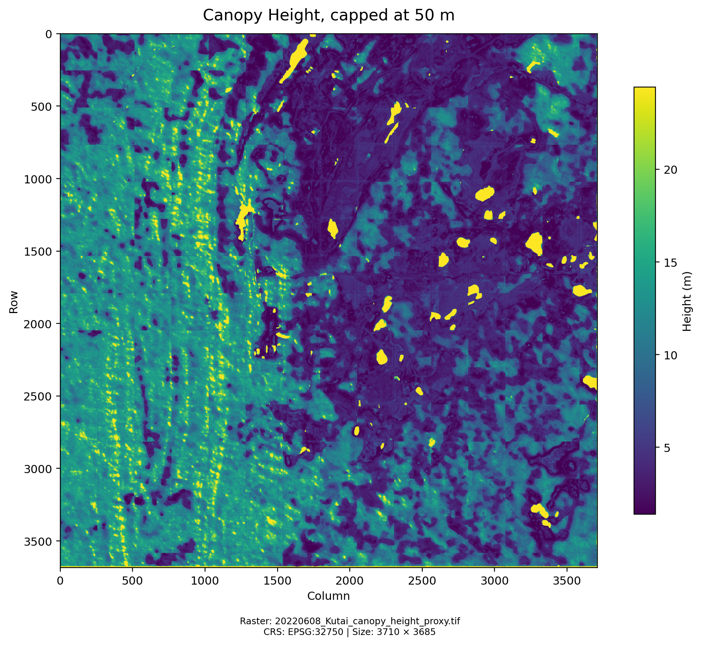
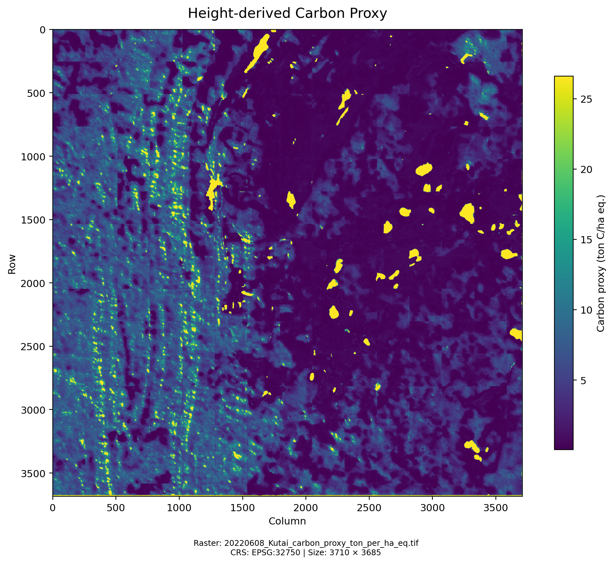
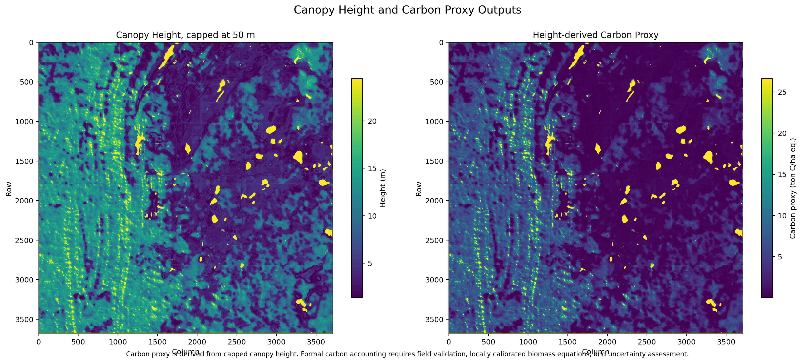

# GeoAI Canopy & Carbon Proxy Mapping

A geospatial machine learning pipeline for estimating **canopy height** and **height-derived carbon proxy** from PlanetScope/SuperDove imagery using GLAD Forest Height 2019 as pseudo-labels.

This repository contains an offline raster processing workflow covering preprocessing, label alignment, training tile generation, U-Net regression, spatial inference, carbon proxy conversion, and output visualization.

---

## Overview

The pipeline follows this workflow:

```text
PlanetScope/SuperDove imagery
+ GLAD Forest Height 2019 pseudo-label
        ↓
Raster alignment
        ↓
Training tile generation
        ↓
U-Net regression model
        ↓
Spatial inference
        ↓
Canopy height raster
        ↓
Height-derived carbon proxy raster
        ↓
CSV report and figures
```

The output is intended for vegetation screening, spatial visualization, and relative comparison. The carbon proxy layer is derived from predicted canopy height and is expressed in ton C/ha equivalent.

---

## Example Outputs

### Canopy Height



### Height-derived Carbon Proxy



### Height and Carbon Proxy Comparison



Additional generated figures are available in [`docs/figures`](docs/figures).

---

## Method

GLAD Forest Height 2019 is used as a coarse height pseudo-label. The GLAD raster is reprojected and resampled to match each PlanetScope/SuperDove training scene.

A U-Net regression model is trained using 8-band PlanetScope/SuperDove imagery as input and the aligned GLAD height raster as target. The trained model is then applied to inference imagery to produce a canopy height raster.

During inference, predicted height values are capped at 50 m to reduce unrealistic model outliers.

The carbon proxy is computed from the capped height raster using:

```text
AGB_proxy_ton_ha_eq = 0.05 × height_m^2.2
Carbon_proxy_ton_ha_eq = AGB_proxy_ton_ha_eq × 0.47
CO2e_proxy_ton_eq = Carbon_proxy_ton_eq × 44/12
```

Operational use in formal carbon accounting, MRV workflows, or carbon credit-related decisions requires field validation, locally calibrated biomass equations, and uncertainty assessment.

---

## Repository Structure

```text
geoai-canopy-carbon-proxy/
  README.md
  requirements.txt
  .gitignore

  scripts/
    00_run_pipeline.py
    01_prepare_project.py
    02_align_glad_to_planetscope.py
    03_make_training_tiles.py
    04_train_unet.py
    05_spatial_inference.py
    06_scene_carbon_report.py
    07_aoi_statistics.py
    08_generate_outputs_inventory.py
    config.py
    dataset.py
    metrics.py
    unet_model.py
    utils_raster.py

  data/
    GLAD/
    raw_train/
    raw_inference/
    aoi/
    processed/
    tiles_dataset/
    output_maps/
    reports/

  docs/
    figures/

  sample_outputs/
    reports/
```

Large raster files, model checkpoints, NumPy training tiles, and generated GeoTIFF outputs are excluded from the repository.

---

## Data Requirements

Place the input files in the following folders:

```text
data/
  GLAD/
    Forest_height_2019_SASIA.tif

  raw_train/
    training_scene_2021_01.tif
    training_scene_2021_02.tif

  raw_inference/
    inference_scene_2022_01.tif

  aoi/
    parcels.geojson
```

| Data | Folder | Purpose |
|---|---|---|
| GLAD Forest Height 2019 | `data/GLAD/` | Height pseudo-label |
| PlanetScope/SuperDove training imagery | `data/raw_train/` | Model training input |
| PlanetScope/SuperDove inference imagery | `data/raw_inference/` | Prediction input |
| AOI GeoJSON | `data/aoi/` | Optional polygon layer for AOI statistics |

PlanetScope/SuperDove rasters are expected to be 8-band GeoTIFFs.

---

## Installation

```bash
pip install -r requirements.txt
```

Main dependencies:

```text
numpy
pandas
rasterio
torch
tqdm
geopandas
shapely
pyproj
matplotlib
```

---

## Running the Pipeline

Run the full offline pipeline from the `scripts/` directory:

```bash
cd scripts
python 00_run_pipeline.py
```

The orchestrator runs the following steps:

```text
01_prepare_project.py
02_align_glad_to_planetscope.py
03_make_training_tiles.py
04_train_unet.py
05_spatial_inference.py
06_scene_carbon_report.py
07_aoi_statistics.py
```

If `data/aoi/parcels.geojson` is not available, AOI statistics are skipped.

---

## Step-by-Step Usage

### 1. Prepare folders and validate inputs

```bash
python 01_prepare_project.py
```

### 2. Align GLAD labels to PlanetScope/SuperDove scenes

```bash
python 02_align_glad_to_planetscope.py
```

Output:

```text
data/processed/aligned_labels/*_glad2019_aligned_to_planet.tif
```

### 3. Generate training tiles

```bash
python 03_make_training_tiles.py
```

Output:

```text
data/tiles_dataset/img_*.npy
data/tiles_dataset/lbl_*.npy
data/processed/normalization_stats.npz
data/processed/tile_scene_index.csv
```

### 4. Train the U-Net model

```bash
python 04_train_unet.py
```

Output:

```text
data/processed/checkpoints/unet_canopy_model.pth
data/reports/training_log.csv
```

For holdout-scene validation:

```bash
python 04_train_unet.py --holdout-scene scene_name_without_tif
```

### 5. Run spatial inference

```bash
python 05_spatial_inference.py
```

Output:

```text
data/output_maps/height/*_canopy_height_proxy.tif
```

### 6. Generate carbon proxy raster and scene report

```bash
python 06_scene_carbon_report.py
```

Output:

```text
data/output_maps/carbon/*_carbon_proxy_ton_per_pixel_eq.tif
data/output_maps/carbon/*_carbon_proxy_ton_per_ha_eq.tif
data/reports/*_scene_report.csv
```

### 7. Optional AOI statistics

```bash
python 07_aoi_statistics.py --aoi ../data/aoi/parcels.geojson
```

Output:

```text
data/reports/*_aoi_statistics.csv
```

### 8. Generate figures

```bash
python 08_generate_outputs_inventory.py --scene 20220608_Kutai
```

Output:

```text
docs/figures/
```

---

## Output Layers

### Canopy height

```text
data/output_maps/height/*_canopy_height_proxy.tif
```

Suggested interpretation:

| Range | Description |
|---|---|
| 0–5 m | Low / non-vegetation |
| 5–15 m | Low canopy |
| 15–30 m | Medium canopy |
| 30–40 m | High canopy |
| 40–50 m | Very high / capped |

### Carbon proxy, ton C/ha equivalent

```text
data/output_maps/carbon/*_carbon_proxy_ton_per_ha_eq.tif
```

Suggested interpretation:

| Range | Description |
|---|---|
| 0–10 | Very low |
| 10–25 | Low |
| 25–50 | Medium |
| 50–100 | High |
| 100–130 | Very high |

### Carbon proxy, ton C/pixel equivalent

```text
data/output_maps/carbon/*_carbon_proxy_ton_per_pixel_eq.tif
```

This layer is useful for AOI-level summation. Summing valid pixel values within a polygon gives the total height-derived carbon proxy for that AOI.

---

## Evaluation Notes

The model is evaluated against GLAD Forest Height 2019 pseudo-labels. The training metrics should be interpreted as pseudo-label agreement rather than field-measured canopy height accuracy.

Validation options:

```text
Basic:
- Random tile split validation

Stronger:
- Holdout scene validation

Additional validation:
- Field plot comparison
- GEDI or LiDAR comparison
- Local biomass calibration
- Uncertainty assessment
```

---

## Limitations

- GLAD Forest Height 2019 is 30 m, while PlanetScope/SuperDove is approximately 3 m.
- The output at PlanetScope grid should be interpreted as a downscaled proxy prediction.
- Temporal mismatch may occur when training imagery and GLAD labels represent different land cover conditions.
- Cloud, haze, shadows, and bright surfaces may produce artifacts if they are not masked.
- The carbon proxy is derived only from canopy height.
- The carbon proxy does not include DBH, wood density, species composition, forest type, or locally calibrated allometric equations.
- Formal carbon accounting requires field validation, local biomass calibration, and uncertainty assessment.
